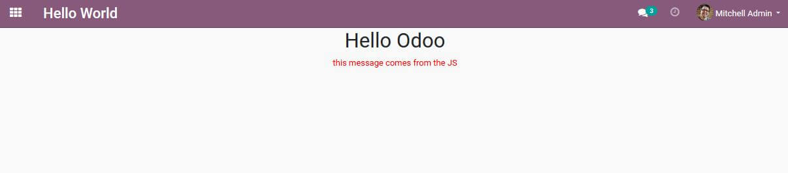

# tutorial_manage_assets

This module is part of the [Oocademy](https://www.oocademy.com/) tutorials.

- [Introduction to the Odoo JavaScript framework](https://www.oocademy.com/v13.0/tutorial/creating-and-using-javascript-assets-in-odoo-54).

- [Creating and using JavaScript assets in Odoo 13](https://www.oocademy.com/v13.0/tutorial/creating-and-using-javascript-assets-in-odoo-54).

This module is part of [Odoo Javascript tutorials](https://www.oocademy.com/v13.0/tutorials?&tag_id=17).

## Tested

- Odoo 13 CE version.

## Screenshot Addon

