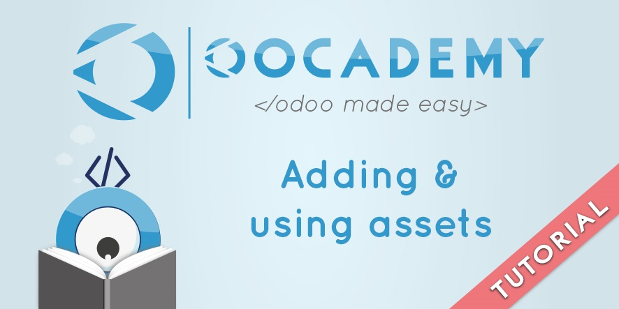
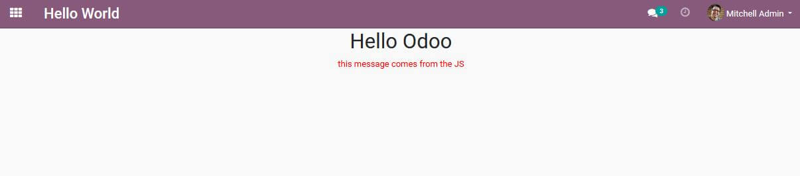

[

Creating and using JavaScript assets in Odoo
============================================

V-13.0

Written by Géry Debongnie

Quick scroll

1. Introduction
---------------

This tutorial is a second in a series of tutorials about the JavaScript
framework. In this tutorial we will explain how Odoo manages assets and
how to add your own assets. We'll create a custom JavaScript module
that implements a client action. Finally we'll add a menuitem and
action and we'll load our own XML template. After this tutorial you
should have a good knowledge about these basics and you can create your
own custom views/actions.

2. Overview of the Odoo assets management
-----------------------------------------

The very first thing that you need to know is how Odoo manages assets.
Like most applications, Odoo needs to interact with a lot of assets
(JavaScript, CSS, XML). Odoo has a very unique feature for assets:
modules are designed to be installed/removed at runtime. This means that
the set of JavaScript (and other) files is not known when the server is
deployed initially and that it can change at any moment in time. It
actually depends on all the installed modules, and these modules can be
updated at any time. Because of that, Odoo needs to be able to
build/prepare its assets at runtime.

### 2.1 Types of assets

In Odoo we have three important categories of assets:

-   JavaScript files. All ``active`` files are concatenated and minified
    in various ``bundles``. These bundles are loaded from the main
    template and contains all the JavaScript code that describes the web
    clients and all its dependencies. It also contains many libraries -
    such as jQuery hotkeys, date pickers, bootstrap, Chart.js and many
    more - and some of these libraries are lazy loaded by Odoo.

-   CSS files. The stylesheets can be described as CSS files or SCSS
    files. Odoo will first compile SCSS files and then bundles all CSS
    files together (and minifies them).

-   XML files: these files contain the templates. Each module describes
    which template files are necessary. These files will then be
    processed by the server, translated and sent to the web client
    whenever Odoo finished loading them. Note that these XML files use
    the QWeb templating engine, just like templates rendered on the
    server. The difference is that they are rendered by the web browser
    (there is a JavaScript implementation of QWeb available in the
    assets).

### 2.2 Understanding asset bundles

Finally, it is important to understand the main categories of bundles.
If you open the network tab of your web browser and reload Odoo, you
will probably see some requests that look like this:

```
/web/content/499-0f03c7b/web.assets_common.js
/web/content/497-0f03c7b/web.assets_common.css
/web/content/500-ae10c27/web.assets_backend.js
/web/content/498-ae10c27/web.assets_backend.css
/web/webclient/qweb/bf598b302fae6d64cae29a50530a9ad7b19bb621?mods=base,web,...
```

The first two lines are the output of the ``assets_common`` bundle. Bundles
contain JS and CSS files, which are converted into a single JS and a
single CSS file. The next two lines are the output of the
``assets_backend`` bundle, and the last request is the call to fetch all
QWeb templates. It may be important to explain a small weird bit of Odoo
terminology: in Odoo, the term frontend refers to the public website,
and backend to the web client, not to the server. This is very confusing
for people that work with other system, but its incredibly hard to
change.

Anyway, from the name of these bundles, you may expect that there is a
``asset_frontend`` bundle, and you're right. The ``asset_common`` bundle
should contain files that are shared between the website and the web
client, and then the other two bundles are specific.

### 2.3 Adding assets

So, how do you add assets to Odoo? You can inherit an existing template
named ``web.assets_backend`` and add a script tag inside of this
inherit with an xpath expression. Odoo knows how to build an asset
bundle by first rendering the ``web.assets_backend`` template - after
it applied all xpath expressions - and then looks inside the xpath which
files need to be processed. Notice that a bundle contains JavaScript,
CSS and SCSS files. Your code would look like this:

**Tip**: don't forget to add this XML file to your ``__manifest.py__`` file!

3. Creating our first JS module
-------------------------------

Enough theory, let's create our very first JavaScript module! To be
able to do this we will need to interact with the Odoo JavaScript module
system. Create a new JavaScript file in your custom module under
``/static/src/js`` named ``hello_world.js``. Add this code for now and
I'll explain it afterwards:

odoo.define('hello_world.main', function (require) {
    const AbstractAction = require('web.AbstractAction');
    console.log(AbstractAction);
});

This is how a JavaScript file can describe a module. JavaScript modules
are defined by a name (``hello_world.main`` here), and a function. That
function receives a special ``require`` function that allows the module
to import other modules.

Note that to prevent name clashes (module names have to be unique),
there is a naming convention: module names should be prefixed with the
Odoo module name. To make this code available in the web browser, we
need to force Odoo to rebuild the asset bundles. To do that, we can
either restart the server or update the module.

**Tip**: This may not be necessary if your server is started with the
``dev=all`` flag or if Odoo is accessed in ``debug=assets`` mode. Refresh your
browser. You'll now see a message in your web browser its console that looks like this:

```
    ƒ Class(){if(this.constructor!==OdooClass){...
```

This is the output of logging a widget in the console. This means that
we successfully imported a JavaScript object defined in the Odoo assets.


4. Making a client action
-------------------------

The next step is to add a client action to our JavaScript. The
``Abstraction`` class that we imported is the base class for all client
actions, which are widgets managed by the Odoo web client. Actions are
basically tiny applications that manage the main area of the screen. For
now, we will subclass this action so it displays a message. Let's
modify our JS code:

```
odoo.define('hello_world.main', function (require) {
    const AbstractAction = require('web.AbstractAction');
    const core = require('web.core');
    const OurAction = AbstractAction.extend({
        start: function () {
            this.$el.html('hello');
        }
    });
    core.action_registry.add('hello_world.action', OurAction);
});
```

So, what does this code do? We use the ``extend`` method to subclass a
widget. We'll go into more detail about classes and widgets in the next
tutorial. For now you just need to know that we create a subclass to add
our custom code into Odoo.

This JavaScript module now does two different things: it defines a
widget (named ``OurAction`` and inheriting from AbstractAction) and it
registers it in the ``action_registry`` object. This is a very common
way of working with Odoo: defining objects, then registering them. This
is the way the Odoo web client is made aware of the existence of widgets
defined in any module.

Once this is done, ``hello_world.action`` is a valid action name from
the point of view of the web client. There is still no way to open it
from the user interface (see next chapter), but we can already test it
manually, by running a command in the console:

``odoo.__DEBUG__.services["web.web_client"].do_action("hello_world.action")``

Note that working with Odoo does not require understanding or learning
the above command! This is just a quick way to test something in the web
client: the first part (``odoo.__DEBUG__.services["web.web_client"]``)
gives you a reference to the instance of the WebClient widget that is currently
displayed in the UI. Then, we call the ``do_action`` method to ask the web
client to perform an action. If all goes well, you should now see a nice 
greeting in the Odoo interface.

5. Adding an action and menuitems
---------------------------------

Clearly, writing commands in the console is not the perfect way of
interacting with Odoo. Lets add an action and a menuitem to make it
easier and available for all our users. Create a new folder ``views`` if
you don't have it yet and then create a new XML file named
``views.xml`` inside. In this XML file we'll create an action and a
menuitem that calls our action. Your code should look like this:

```
Tutorial Demo hello_world.action
```

We also have to update our ``__manifest.py__`` file so that Odoo
knows it should load this new XML file. Open up your manifest and add
the file in the ``data`` key:

```
    'data': ['views/views.xml'],
```

Since we've modified some core files for our module we have to update
the module again. After updating the app you'll see there is a new
menuitem which points to our client action. Our JavaScript code is now
alive!

6. Adding a template
--------------------

The final step is to make our widget render a custom XML template. This
will teach you how to load static templates in the web browser in Odoo.
Static templates work different than the default XML records. They are
not loaded with an asset bundle. These templates are defined in static
XML files which are registered in the manifest of your module. Once this
is done the template(s) will be loaded automatically by the web client
when the action is called.

Let's start by creating a new XML file. Name it ``hello_world.xml``
and place it under ``/static/src/xml/``. Let's add a very basic XML
template in it:

```
Hello Odoo
```

This code will just create an XML template which shows ``Hello Odoo`` as
a title and shows the value of ``widget.info``, which we'll set in
JavaScript soon! Notice that we also have a CSS class ``hello-world``
set for styling purposes. We'll create this class later in the tutorial
too. Let's first make sure that Odoo can load our XML template. Open
your ``__manifest.py__`` file and add in a new key ``qweb`` which
loads our XML file:

```
    'qweb': ['static/src/xml/hello_world.xml',],
```

This is enough for Odoo to know that it should load the XML as a
template and that it should not be stored in the Odoo database. The last
step is to modify our JavaScript widget to tell the framework that it
should now be rendered with our template. Open up your
``hello_world.js`` file again and modify ``OurAction`` so that it loads
the template:

```
    const OurAction = AbstractAction.extend({
        template: "hello_world.ClientAction",
        info: "this message comes from the JS"
    });
```

After updating our module - since we've modified the manifest again -
and after reloading the web browser you will see the result of your work
displayed in the user interface!

7. Adding CSS
-------------

We're almost done! There's just one more thing to do: adding a CSS
file for our ``hello-world`` class. Since stylesheets are managed just
like JavaScript files it works pretty much the same as adding JS files.
Create a new file named ``hello_world.css`` under ``static/src/css``
and let's add in some basic CSS:

```
    .hello-world {color: red;}
```

Now add this CSS file to the assets bundle so that Odoo knows that it
needs to load our CSS. Open your ``assets.xml`` file again and add in
the CSS file with a link. Your assets file should now look like this:

That's it! Update your module again and you'll see your client action
is now styled. You should now see something like this as a result:



8. Conclusion
-------------

In this tutorial we've learned how Odoo manages assets and how we can
work with assets. As you've noticed the process is not very complicated
but it requires quite some small steps:

-   JS and CSS files should be created under the ``static`` folder, then
    added by an xpath in the appropriate asset bundle (usually, this is
    done in a file named ``assets.xml``), and this last xml file need to be
    registered in the manifest of your module.

-   XML static templates need to be registered in the manifest as well.

After this tutorial you know how to add JS, CSS, XML templates and how
to call XML templates. It's a big step forward to creating your own
widgets or even new view types and it's important to understand these
steps before continuing. At this point our widget is not much more than
an XML template but in the next tutorial you will learn how you can use
the ``Widget`` class to make more interactive and complex widgets.

**Tip:** the next tutorial is currently still in development. It will be
published soon!

